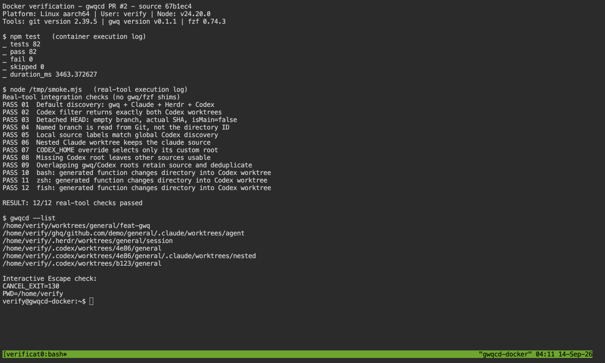
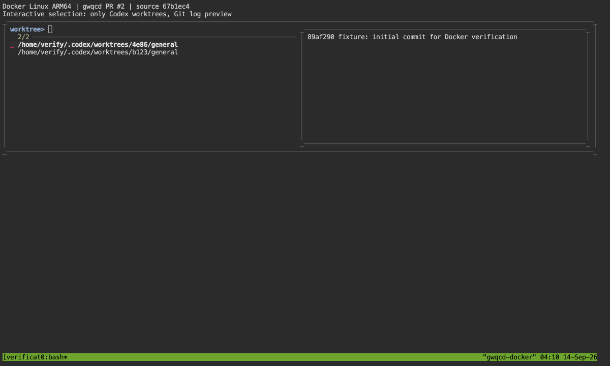
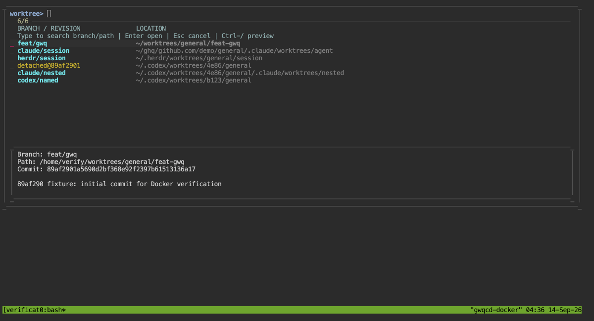
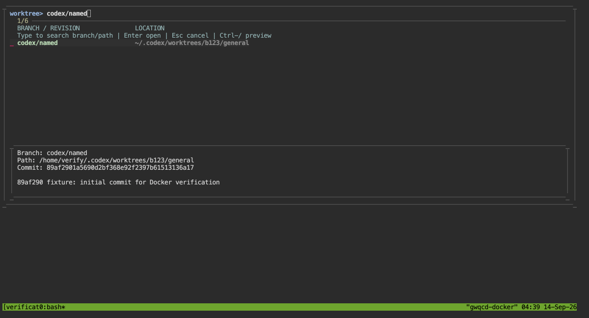
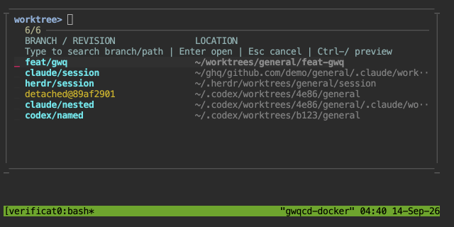

# Docker verification — PR #2

Verified source: `67b1ec44f64354747b7ad933ad89dcd8c80dbc2c` on 2026-09-14.
The evidence-only commit containing this report does not change runtime code.

## Environment

- Docker Desktop 4.68.0, Engine 29.3.1; Linux ARM64 / Debian 12.
- Node 24.20.0, Git 2.39.5, gwq 0.1.1, fzf 0.74.3.
- bash, zsh 5.9, fish 3.6.0; non-root user `verify` (UID 1002).
- Dedicated image `gwqcd-pr2-codex-verification:67b1ec4`, built from the
  existing local `gwqcd-e2e` image with a `git archive` of the source above.
- No host worktrees, credentials, or Docker socket mounted into the container.
- tmux plus ttyd 1.7.7 displayed the actual container terminal through a
  localhost-only port. Screenshots are browser captures of that terminal,
  not generated illustrations. The test-summary screen displays saved output
  from the actual container test processes, followed by a live `gwqcd --list`.

## Results

| Check | Result |
| --- | --- |
| `npm test` inside `/opt/gwqcd` | 82 passed, 0 failed, 0 skipped |
| Real-tool integration checks (no gwq/fzf shims) | 12 passed |
| Default discovery | 1 gwq, 2 Claude, 1 Herdr, 2 Codex |
| `--source codex` | Both Codex worktrees only |
| Detached HEAD / named branch metadata | Empty branch / `codex/named`; Git SHA matches |
| `--local` source classification | Matches global Codex classification |
| Nested Claude worktree | Remains `source: claude` |
| `CODEX_HOME` override / absent root | Correct custom root / other sources remain usable |
| Overlapping gwq and Codex roots | No duplicate candidates; Codex label retained |
| Generated bash / zsh / fish functions | Change directory into the selected Codex worktree |
| Interactive fzf with Git log preview | Displays exactly two Codex candidates |
| Interactive Enter | Moves to `/home/verify/.codex/worktrees/4e86/general` |
| Interactive Escape | Exit 130, stays in `/home/verify` |

The fixture is a real Git repository with real linked worktrees. The gwq
worktree was created using `gwq add -b`; Codex, Claude and Herdr layouts were
created with `git worktree add` at their respective conventional paths. The
agent applications themselves were not launched inside the container.

The reported Codex fixture was detached at
`89af2901a5690d2bf368e92f2397b61513136a17`. A second Codex fixture used branch
`codex/named`; a third, custom-root fixture exercised `CODEX_HOME`.

## Captures

Full-suite and real-tool results, live listing, and Escape behavior:

Actual interactive fzf selection with Codex candidates and Git log preview:

## Branch picker UX follow-up

Verified runtime source: `6ad5d69` (2026-09-14). Current bin and test files were
copied into the same isolated container described above.

- Host and container suites: **90 passed, 0 failed, 0 skipped** each.
- Independent reviewer: all 90 tests passed; no blocking findings.
- All 12 real-tool integration checks above passed again.
- Typed `codex/named` in the real fzf UI: one match despite the directory being
  `b123/general`; Enter changed the shell directory to that exact worktree.
- Typed `detached@`: selected the detached fixture; Enter changed the shell
  directory to `/home/verify/.codex/worktrees/4e86/general`.
- Escape returned 130 and preserved that working directory.
- Ctrl-/ opened and closed the bottom preview. At 640 × 320 the preview started
  hidden; all six candidates remained visible. At 1200 × 650 it started open.
- Startup from sending `gwqcd` to observing the populated six-candidate list:
  155.8, 144.9, 165.8ms; median **155.8ms**. This includes Docker/tmux polling
  overhead and is a small-fixture observation, not a large-repository benchmark.
- `npm pack --dry-run` includes the new `bin/picker.mjs`; `git diff --check`
  passed. Unit tests also cover Unicode/control characters, exact path mapping,
  colorless labels, malformed selection keys and safe Git preview arguments.

Branch-first list with full details below:

Searching the actual branch rather than the opaque directory ID:

Short terminal with preview initially hidden:

